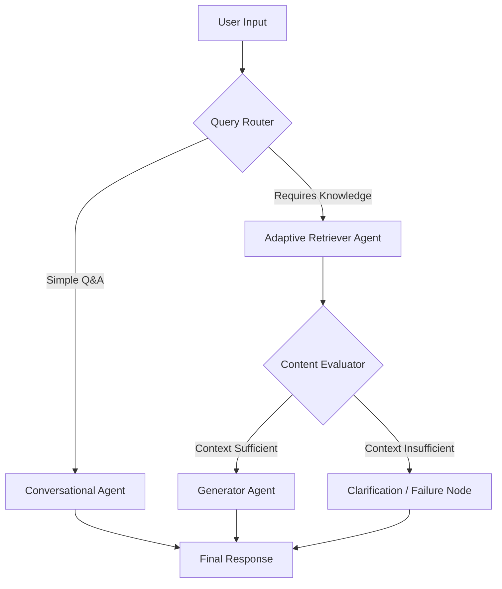

# Quasar: An Agentic, Adaptive RAG Platform


**An Agentic, Adaptive RAG Platform for Enterprise Knowledge**

##  Vision & Objective

**Vision:** To build a state-of-the-art, fully agentic Retrieval-Augmented Generation (RAG) platform that allows users to have insightful, accurate, and verifiable conversations with a diverse corpus of private enterprise documents.

**Core Problem:** Standard RAG is often brittle. It can fail if retrieval is poor, and it lacks the ability to reason about its own knowledge gaps. Quasar transcends these limitations by incorporating an **adaptive, agentic layer** that intelligently decides _how_ and _when_ to retrieve information, and even when to seek clarification or admit it doesn't know. This project serves as a demonstration of a production-grade, multi-modal RAG system.

##  System Architecture: Adaptive Agentic RAG

Quasar's architecture is not a simple, linear pipeline. It is an intelligent, conditional graph where an agent makes decisions at critical junctures.



## Full-Stack Application Architecture Diagram
This shows the higher-level architecture of how the entire containerized application works, from the user's browser all the way to the backend services running in Docker.

```mermaid
graph TD
    subgraph "User's Local Machine"
        User[fa:fa-user User] --> Browser[Web Browser];
    end

    subgraph "Docker Environment (Managed by docker-compose)"
        Frontend[fa:fa-window-maximize Nginx Frontend Container];
        Backend[fa:fa-server FastAPI Backend Container];
        Database[(fa:fa-database PostgreSQL/pgvector DB)];
    end
    
    subgraph "External Services"
        OpenAI[fa:fa-cloud OpenAI API];
    end

    User -- "1. Accesses UI at http://localhost:8501" --> Browser;
    Browser -- "2. Loads HTML/CSS/JS" --> Frontend;
    Browser -- "3. Sends API Request (e.g., /api/v1/chat)" --> Frontend;
    Frontend -- "4. Forwards API request via reverse proxy" --> Backend;
    Backend -- "5. Invokes RAG Agent" --> AgentLogic{RAG Agent Logic};
    AgentLogic -- "6a. Retrieves context" --> Database;
    AgentLogic -- "6b. Sends prompt for embeddings/generation" --> OpenAI;
    Database -- "Returns documents" --> AgentLogic;
    OpenAI -- "Returns embeddings/answer" --> AgentLogic;
    AgentLogic -- "7. Returns final answer" --> Backend;
    Backend -- "8. Sends API Response" --> Frontend;
    Frontend -- "9. Sends response to browser" --> Browser;
    Browser -- "10. Displays answer to user" --> User;
    ```

##  Tech Stack

This project uses a modern, production-ready stack designed for performance, scalability, and powerful AI capabilities.

| Layer                   | Stack                                     | Justification                                                                              |
| ----------------------- | ----------------------------------------- | ------------------------------------------------------------------------------------------ |
|  **LLM Backbone** | GPT-4o / Claude 3 Opus / Gemini 1.5 Pro   | Top-tier models with large context windows and strong reasoning for agentic decisions.      |
|  **Agent Orchestration** | **LangGraph** | Essential for building complex, stateful, and conditional agentic workflows.                |
|  **Vector Database** | **PostgreSQL with `pgvector`** or ChromaDB | `pgvector` allows storing structured metadata and vectors in one place.                    |
|  **Embedding Model** | **OpenAI `text-embedding-3-large`** | State-of-the-art model that excels at capturing semantic nuance for retrieval. |
|  **Data Ingestion** | `unstructured.io` / `LlamaIndex` Readers  | Robust libraries for parsing a wide variety of file formats like `.pdf`, `.docx`, etc.  |
|  **Backend & API** | **FastAPI** | High-performance, scalable framework for serving the RAG agent as a robust API.     |
|  **Frontend Demo** | **Custom HTML, CSS, JS** | A custom, decoupled frontend for a polished and controlled user experience.                |
|  **Persistence & Memory** | **PostgreSQL** | A robust SQL database is non-negotiable for session management and persistent memory. |
|  **Monitoring** | **LangSmith & Comet ML** | For deep agent tracing (LangSmith) and high-level experiment tracking (Comet).             |

##  Core Features

### 1. The Data Ingestion Pipeline (The "Librarian")
An asynchronous, offline process that prepares the knowledge base.
-   **Multi-Modal Document Loading:** Supports ingestion of `.pdf`, `.txt`, `.pptx`, `.docx`, `.xlsx`, and web links using `unstructured.io`.
-   **Intelligent Text Chunking:** Employs context-aware strategies like `RecursiveCharacterTextSplitter` to keep related text together.
-   **Rich Metadata Storage:** Stores vectors alongside rich metadata (`source_filename`, `page_number`, etc.) for filtering and citation.

### 2. The Agentic Retrieval Graph (The "Detective")
The real-time graph that interacts with the user, featuring:
-   **Query Router:** An LLM-powered node that first analyzes the user's query and decides whether to engage in simple conversation or activate the knowledge retrieval workflow.
-   **Adaptive Retriever:** Formulates a multi-pronged retrieval strategy, including query transformation and hybrid search (semantic + keyword).
-   **Content Evaluator:** Assesses the quality of retrieved documents to decide if they are sufficient to answer the question.
-   **Cited Generation:** The final answer is generated *only* from the provided context and includes inline citations for verifiability.
-   **Graceful Failure:** When context is insufficient, the agent politely states what it couldn't find instead of hallucinating.

##  Getting Started

Follow these instructions to set up and run the project locally.

### Prerequisites

-   **Git:** To clone the repository.
-   **Python 3.11+**
-   **Poetry:** For dependency management. Install it via the official instructions.
-   **(For Windows Users) WSL 2:** It is highly recommended to run this project inside WSL 2 for a Linux-like environment that avoids common Windows compatibility issues.

### 1. Clone the Repository

```bash
git clone <your-github-repo-url>
cd quasar
```

### 2. Set Up Environment

This project uses `Poetry` to manage dependencies.

```bash
# Install all project dependencies (including dev dependencies)
poetry install
```

### 3. Configure Environment Variables

Create a `.env` file in the root directory of the project. This file will store your secret keys and is ignored by Git.

```
# .env

# OpenAI API Key
OPENAI_API_KEY="sk-..."

# LangSmith Configuration (for tracing and debugging)
LANGCHAIN_TRACING_V2="true"
LANGCHAIN_ENDPOINT="[https://api.smith.langchain.com](https://api.smith.langchain.com)"
LANGCHAIN_API_KEY="..."
LANGCHAIN_PROJECT="Quasar" # Or any name you prefer

# Comet ML API Key (for experiment tracking)
COMET_API_KEY="..."
```

### 4. Run the Application

This is a decoupled application with a FastAPI backend and a custom frontend. You need to run the backend server first.

**To Start the Backend API:**

Use `uvicorn` to run the FastAPI application. The `--reload` flag will automatically restart the server on code changes.

```bash
poetry run uvicorn app.main:app --reload
```


**To Use the Frontend:**

Simply open the `frontend/index.html` file in your web browser. The JavaScript in the file is configured to communicate with the backend server running on port 8000.

##  Project Milestones

| Phase | Description                                                                    | Key Technologies                                                    |
| ----- | ------------------------------------------------------------------------------ | ------------------------------------------------------------------- |
| **P1** | **Foundation & Ingestion**                                               | `FastAPI`, `PostgreSQL/pgvector`, `unstructured.io`, `OpenAI Embeddings` |
| **P2** | **Basic RAG Pipeline**                                                   | `LangGraph`, `ChatOpenAI`                                               |
| **P3** | **Agentic Layer**                                                        | `LangGraph` conditional edges                                         |
| **P4** | **Advanced Retrieval**                                                   | `SQLAlchemy` (for keyword search), advanced prompting               |
| **P5** | **UI & Deployment**                                                      | Custom `HTML/CSS/JS`, `Docker`                                          |

```